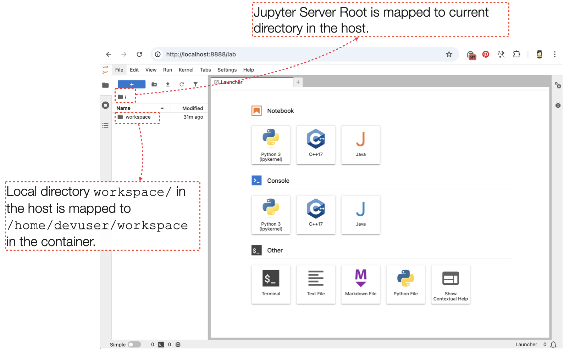

## JAPPY: Educational resource for programming classes in **JA**va, c**PP** (C++) and p**Y**thon

JAPPY is a development environment designed as an educational resource for programming classes using Java, C++ or Python. It can be used independently through a) a Jupyter client connected to port `8888/tcp` or b) using the VSCode IDE with the *devcontainer* plugin.

### Using a Jupyter client

To use JAPPY with a Jupyter client, you must use the [_docker-compose.yml_](classroom/docker-compose.yml) file available in the [_classroom_](classroom/) directory.

```
services:
  jappy:
    platform: linux/amd64
    image: gastudil/courses:jappy-vscode
    container_name: dev-jappy
    hostname: dev-jappy
    ports:
      - 8888:8888
    volumes:
      - ./workspace:/home/devuser/workspace
    environment:
      WORKSPACE: /home/devuser/workspace
    ...
```
>Note: If the host is a computer with arm architecture (for example, mac computers with Mx processor), the `platform` field must be changed to `linux/arm64`.

Assuming the [_docker-compose.yml_](classroom/docker-compose.yml)  file is copied to a directory called `classroom`, a possible file structure to use with JAPPY is:

><pre>
>classroom/
>    └── docker-compose.yml
></pre>

When deploying this setup, docker compose maps the container port `8888/tcp` to port `8888/tcp` of the host as specified in the compose file. Also, the docker compose file maps the local directory named `workspace` to the `/home/devuser/workspace` directory located in the container. This allows work files to be stored in the container and persisted on the host. When the container is started, if the workspace directory does not exist, it is automatically created.

><pre>
>classroom/
>    ├── workspace/
>    └── docker-compose.yml
></pre>

#### Deploy with docker compose

```
$ docker compose up -d
```

When you run this command, the following output is expected:

><pre>
>[+] Running 2/2
> ✔ Network classroom_back_net  Created
> ✔ Container dev-jappy         Started
></pre>

Optionally, you can check that containers are running and port mapping:

```
$ docker compose ps
```

><pre>
>NAME        IMAGE                            COMMAND                  SERVICE   CREATED          STATUS          PORTS
>dev-jappy   gastudil/courses:jappy-jupyter   "/usr/bin/supervisor…"   jappy     42 seconds ago   Up 41 seconds   80/tcp, 0.0.0.0:8888->8888/tcp
><pre>

Navigate to `http://localhost:8888` in your web browser to access Jupyter server. This jupyter server contains the kernels for Python, Java and C++. The *Jupyter Server Root* is mapped to current directory in the host (`classroom` directory in this example). The local directory `workspace`in the host is mapped to `/home/devuser/workspace` in the container.

<div align="center">

</div>

Finally, to stop and remove the containers:

```
$ docker compose down
```
